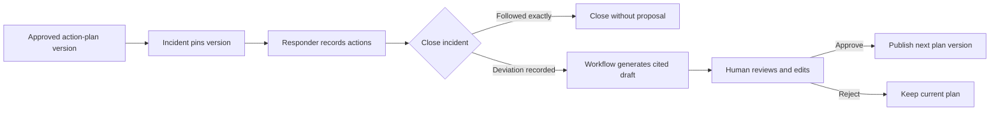

# PlanLoop

*A full-stack incident-response system that turns operational evidence into human-reviewed action-plan improvements.*

Read the [product workflow](docs/product-workflow.md) for the end-to-end user journey.


---

## Quick Start (Local Development)

PlanLoop requires Node.js 24 and npm. Proposal generation uses Workers AI, so
that workflow also requires an authenticated Cloudflare account.

```bash
# 1. Clone and install
git clone https://github.com/pakka-papad/planloop.git
cd planloop
npm install

# 2. Authenticate with Cloudflare and generate binding types
npx wrangler login
npm run cf-typegen

# 3. Create and seed the local D1 database
npm run db:migrate:local
npm run db:seed:local

# 4. Start the application
npm run dev
```

Local D1 data and Workflow state live under `.wrangler/` and are not committed.
The seed is safe to rerun and contains five realistic action plans with version
history.

### Inspect Local State

Cloudflare's local
explorer is available at
[http://localhost:5173/cdn-cgi/local/explorer](http://localhost:5173/cdn-cgi/local/explorer).
It shows local Workflow instances, including their status, steps, retries, and
errors.

---

## Verification

The test suite exercises persistence and complete API flows without calling an
external model.

```bash
# Type and lint checks
npm run typecheck
npm run lint

# Build and run every test
npm test

# Run one test layer
npm run test:integration
npm run test:e2e
```

- **Integration tests** cover proposal-generation validation, persistence,
  concurrency, and failure handling against local D1.
- **E2E tests** run the Worker through Wrangler's local harness and exercise the
  action-plan, incident, and review-proposal APIs.
- **Test bindings** replace Workers AI and Workflow dispatch, keeping automated
  tests deterministic and independent of a Cloudflare account.

---

## Technical Overview

PlanLoop keeps operational action plans useful by connecting an immutable plan
version to the actions actually taken during an incident. If the response
deviates from the pinned plan, a durable workflow asks Workers AI for an
evidence-backed update draft. A human reviewer can edit, reject, or approve the
draft; only approval publishes a new plan version.

The React application and REST API are deployed as one Cloudflare Worker. The
backend follows explicit HTTP, application, domain, and persistence layers and
uses D1 directly through prepared SQL statements.

```text
React UI
   │
REST API (/api/v1)
   │
Application services
   ├── Domain models and rules
   ├── D1 persistence
   └── Workflow → Workers AI
```

---

## Core Architecture

### 1. Immutable Action Plans

- An action plan is identified by a stable ID and has one or more approved
  versions.
- The plan name, usage guidance, and ordered steps are versioned together.
- Incidents pin an exact version, so an active response cannot change when a
  newer version is published.

### 2. Incident Action Log

- Responders record completed, skipped, modified, and additional actions in
  execution order.
- Closing an incident requires every pinned plan step to be represented in the
  action log.
- An incident followed the plan as written only when every pinned step was
  completed exactly once and in the original order. That path closes without a
  review proposal.

### 3. Evidence-Backed Proposal Generation

- Closing a deviating incident attaches it to the active proposal for its
  action plan and starts a Cloudflare Workflow.
- The workflow aggregates attached closed incidents, their pinned plans, and
  their action records before requesting a structured draft from Llama 3.3.
- Model output is schema-validated. Each proposed change must cite the action
  records that support it, and generation failures remain visible and retryable.

### 4. Human Review and Publication

- Reviewers compare the source plan with the proposed plan, inspect cited
  evidence, and edit plan details or ordered steps inline.
- Revision ETags protect draft edits, retries, and decisions from concurrent
  updates.
- Approval atomically publishes the next immutable plan version. Rejection
  closes the proposal without changing the action plan.

---

## Product Flow



---

## Technology Stack

- **Frontend**: React 19, Vite 8, Tailwind CSS 4, and the shadcn/ui
  `b3SRcd4mA` preset with Base UI, Public Sans, and Phosphor icons.
- **Backend**: TypeScript on Cloudflare Workers with layered HTTP, application,
  domain, and persistence modules.
- **Data and workflows**: Cloudflare D1, Cloudflare Workflows, and Workers AI
  using `@cf/meta/llama-3.3-70b-instruct-fp8-fast`.
- **Validation and verification**: Valibot, Vitest, Wrangler's test harness,
  TypeScript, and Oxlint.

---

## Tradeoffs / Non-Goals

- **Trusted-environment MVP**: the application does not authenticate users or
  authorize requests. Actor fields remain `null`.
- **Manual plan selection**: incident creation requires the current action-plan
  version ID. The system does not recommend or select a plan from incident text.
- **Recording, not remediation**: PlanLoop records response activity and uses it
  as review evidence. It does not run infrastructure commands or establish that
  a recorded deviation was safe or correct.
- **No external-system synchronization**: plans, incidents, actions, and review
  decisions are entered in PlanLoop. Monitoring, chat, ticketing, and incident
  management systems are not imported, updated, or kept in sync.
- **Cloudflare-specific runtime**: the application depends directly on Workers,
  D1, Workflows, and Workers AI. Moving to another platform requires replacing
  those runtime and persistence integrations.

---

## Documentation

- [Product workflow](docs/product-workflow.md)
- [API RFC](docs/apis/planloop-api-rfc.md)
- [Known product gaps](docs/known-product-gaps.md)
