# Product Workflow

PlanLoop turns a completed incident into an improvement to the action plan used
to resolve it. The improvement is always reviewed by a human before it becomes
the next approved version.

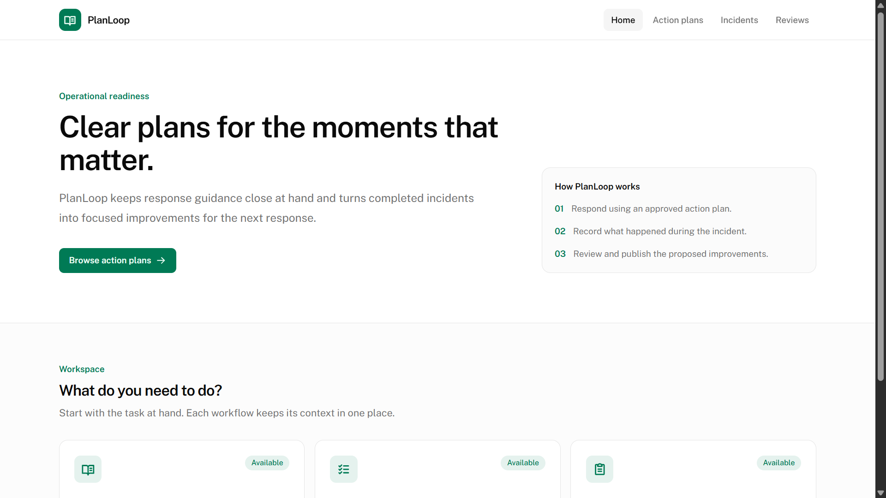

The home page leads responders to the action plans, open incidents, and review
proposals that need attention.

## 1. Create an action plan

An action plan defines when it applies and the ordered steps responders should
take. Creating a plan publishes version 1 immediately. Its identity remains
stable, while its name, usage criteria, and steps are versioned together.

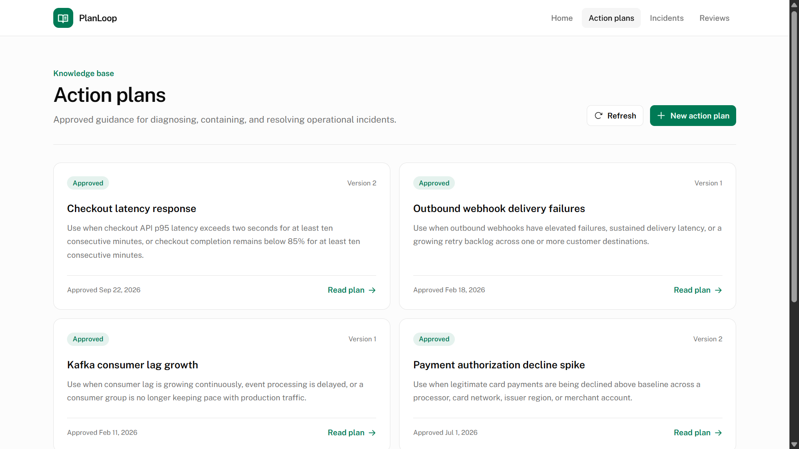

The action-plan list shows each plan's current approved version. Select a plan
to read it, or create a new one.

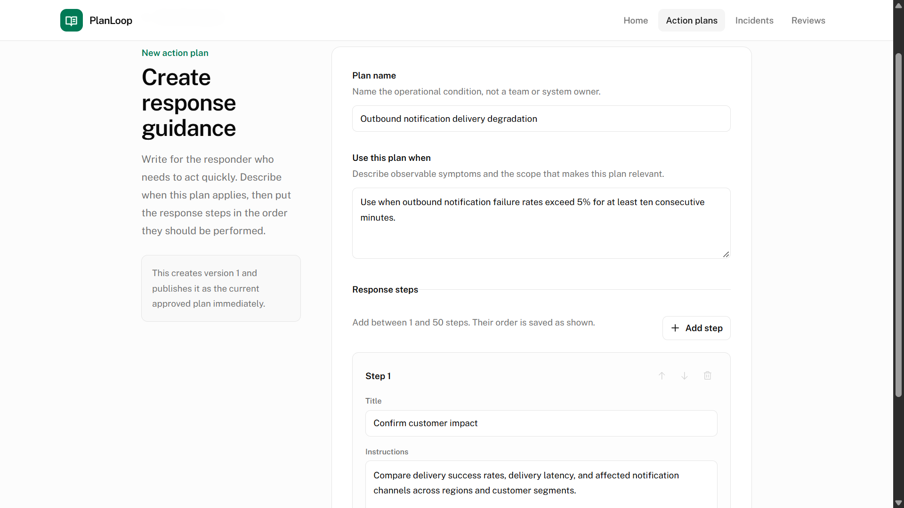

The creation form captures the plan name, the condition that makes it relevant,
and the ordered response steps.

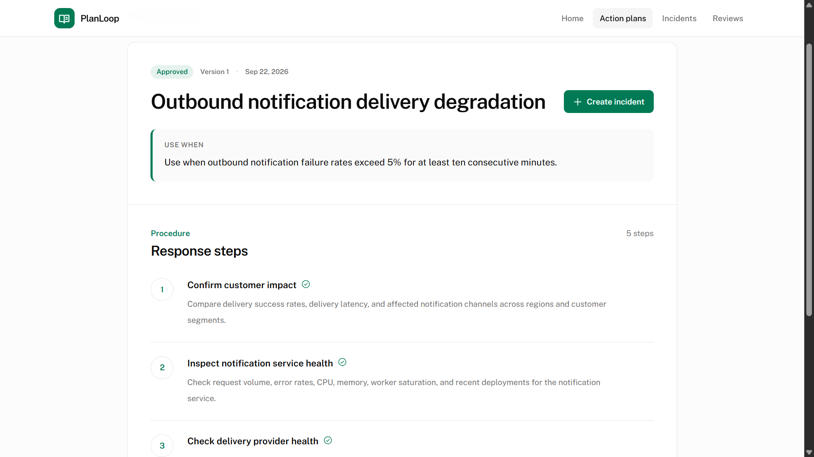

An approved action plan is a readable procedure. Starting an incident from
this page pins the displayed version.

## 2. Start and work an incident

The responder selects an approved action plan and starts an incident. The
incident permanently pins that exact version, so later plan changes cannot
alter the guidance used during the response.

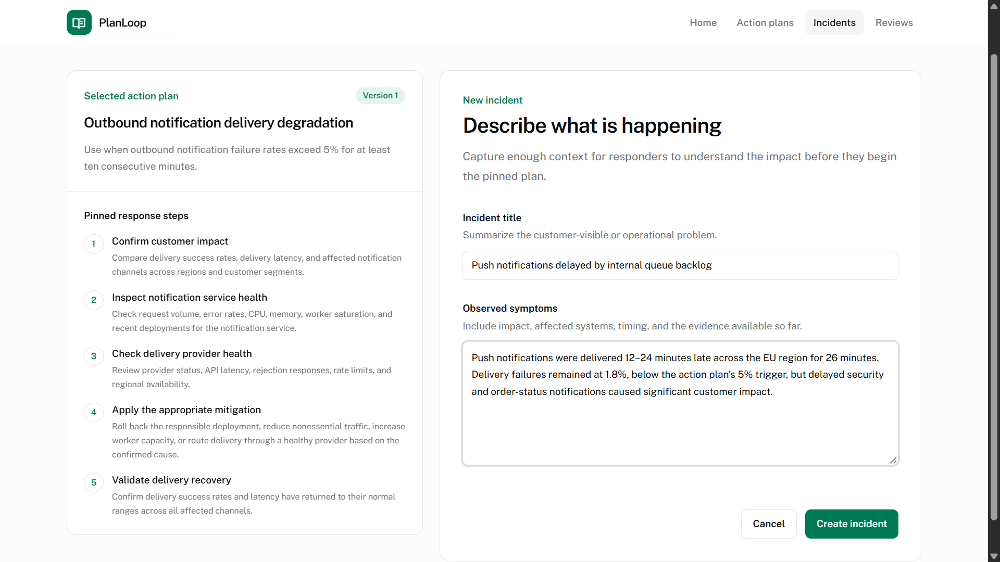

The incident form keeps the selected plan visible next to the incident details
so the responder can confirm the guidance before starting work.

As work progresses, the responder appends action records in execution order:

- Complete a plan step as written.
- Skip a plan step.
- Record a modified execution of a plan step.
- Record an additional action that was not in the plan.

A plan step can be recorded more than once because the incident log captures
what actually happened, not an idealized checklist.

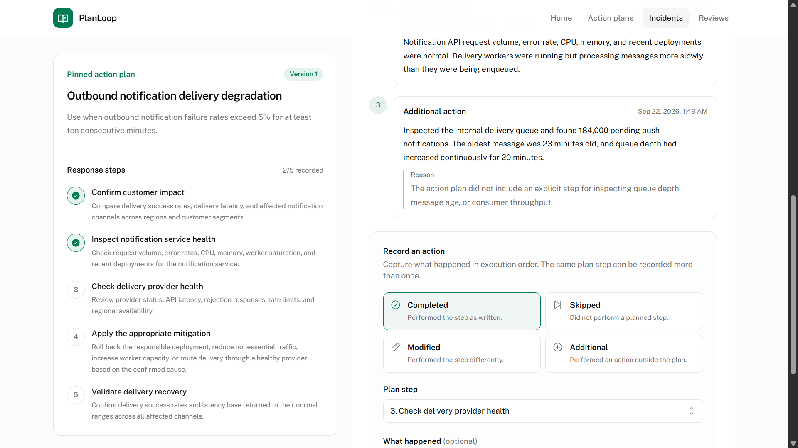

The incident editor shows the pinned procedure beside the chronological action
log. It supports recorded plan steps and additional actions outside the plan.

## 3. Close the incident

Closure requires at least one action record for every pinned plan step.

If every pinned step was completed exactly once and in the original order, the
incident closes without a proposal. Any skipped, modified, repeated, reordered,
or additional action is a deviation.

Closing a deviating incident attaches it to the one active review proposal for
its action plan. A Cloudflare Workflow collects the proposal's closed,
contributing incidents and generates an evidence-backed draft. If generation
fails after its automatic retries, the reviewer can retry it.

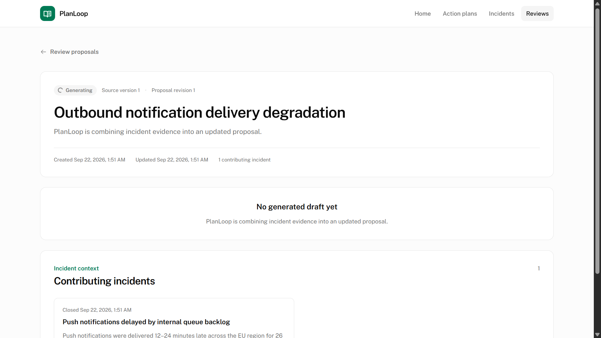

Generation is visible to the reviewer. The proposal remains available while
the workflow is combining the contributing incident evidence.

## 4. Review the proposed plan

The reviewer compares the source version with the proposed plan. Each suggested
change links to the action records that support it; the reviewer can inspect
that evidence without leaving the proposal.

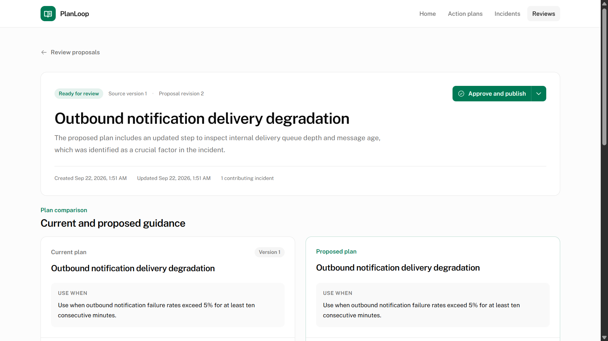

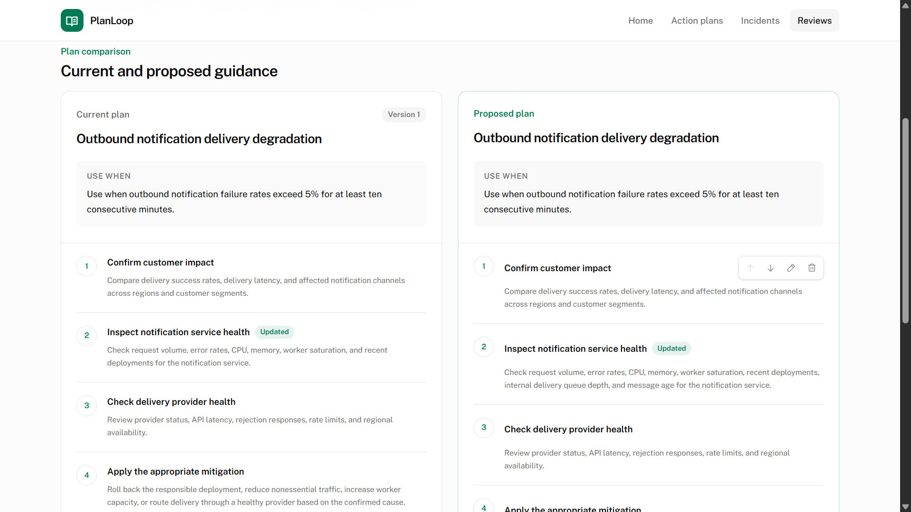

Selecting a change opens its supporting evidence, keeping the reason for the
change close to the comparison.

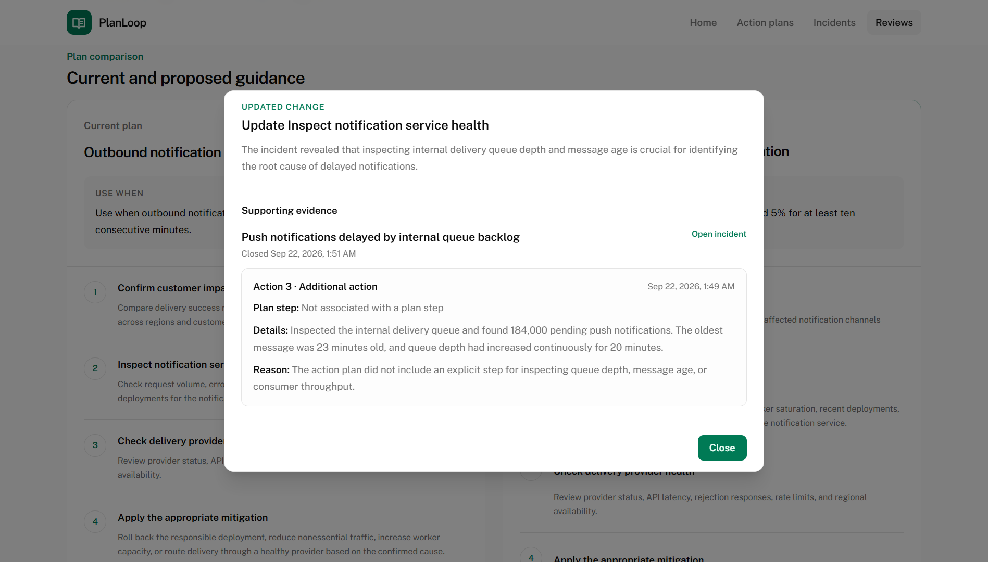

The reviewer can edit the proposed name or usage criteria, add, update, delete,
or reorder steps, and choose the supporting action records for their edits.
Saving keeps the proposal's change list aligned with the resulting draft.

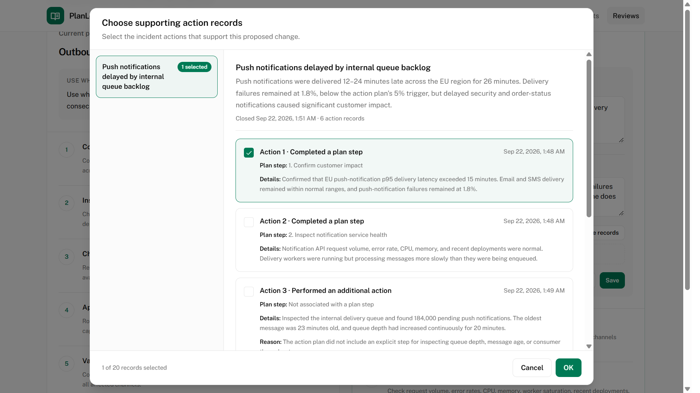

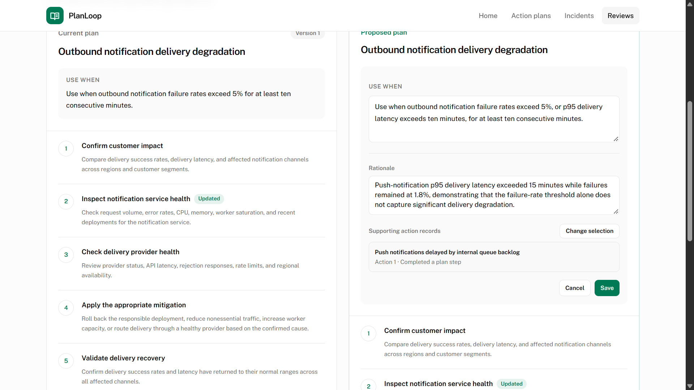

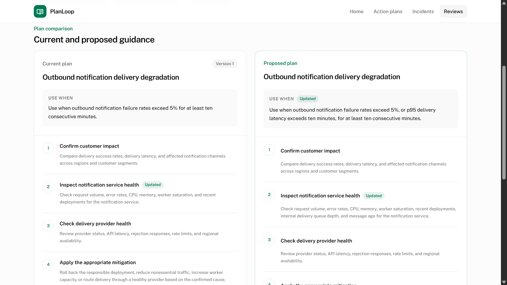

## 5. Decide and publish

The reviewer has two choices:

- **Approve and publish** creates the next immutable version of the action
  plan. New incidents then use that version.
- **Reject** closes the proposal without changing the current action plan.

The completed incident history and the source plan version remain unchanged in
both cases.

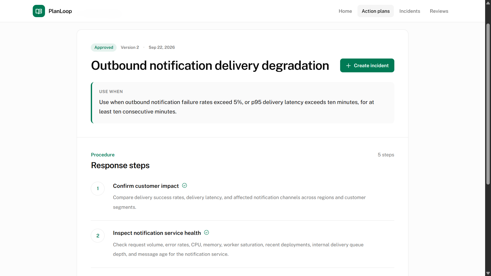
